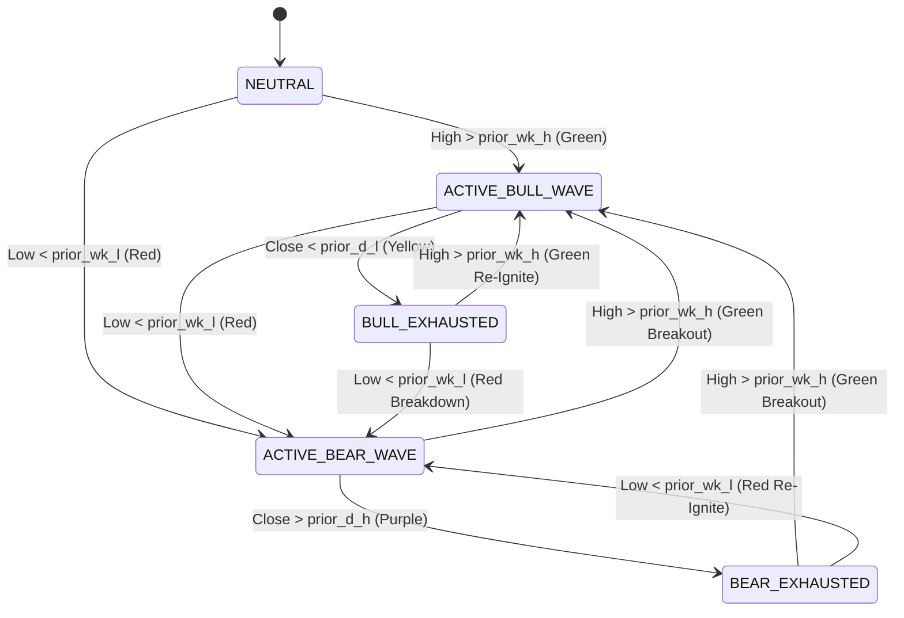
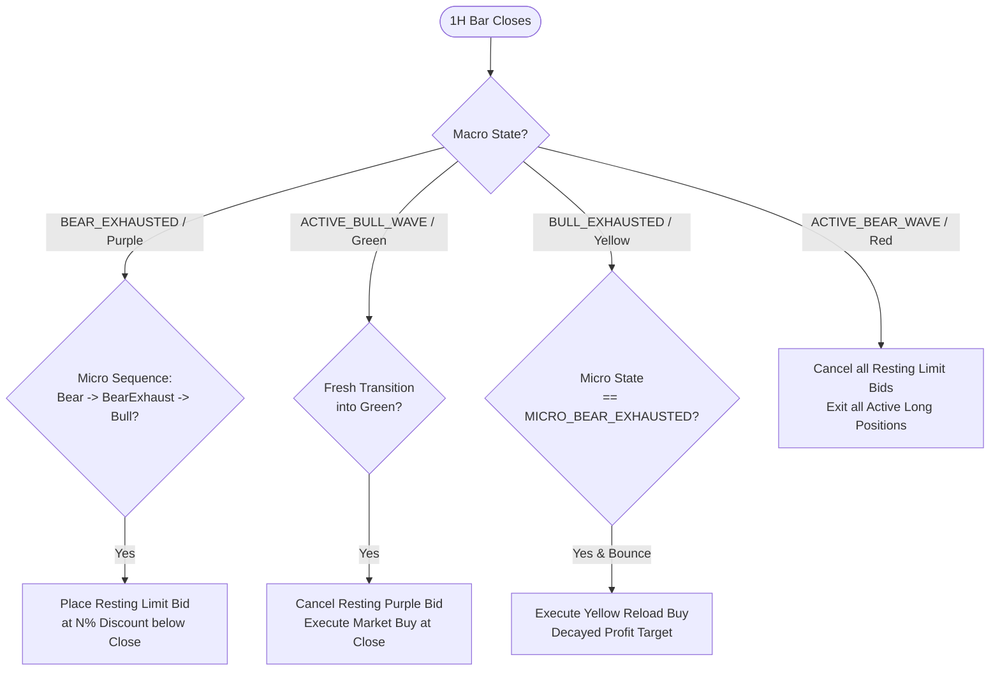

# Master Production Strategy Specification: Dual-Tier Structural Wave & Inventory Harvesting Lab
**Project Singularity $\rightarrow$ Live Deployment Engine (Project Accretion)**  
*Author:* Jesse Lentz & Singularity Core Lab  
*Date:* August 2026  
*Status:* **RESEARCH VALIDATED / READY FOR PRODUCTION PORTING**

---

## 1. Executive Summary & Mathematical Core Thesis

### 1.1 First Principles Overview
Traditional retail indicators (RSI, MACD, Bollinger Bands, Moving Average crossovers) attempt to forecast future price trajectories using lagging mathematical smoothing. In the Singularity framework, **we do not forecast or predict the future**; we mathematically describe **where price is located inside hierarchical physical range containers**.

The market operates as a physical system of nested liquidity containers:
1. **Kinetic Displacement (Expansion):** Price aggressively expands the boundaries of a parent container.
2. **Exhaustion & Invalidation (Boundary Violations):** Kinetic thrust terminates when price can no longer sustain higher lows (or lower highs) and physically breaches trailing invalidation floors.
3. **Consolidation & Energy Rest (Compression):** Price pauses inside parent ranges to build inventory before launching the next wave.

### 1.2 Core Empirical Baseline (Kraken BTC/USD 2020–2026 | 58,412 Hourly Bars)
The master unfiltered structural scalper strategy achieved the following audited performance over 6 continuous years:

| Performance Metric | Standard Taker Model (0.038% round-trip) | Maker-Fee Model (0.0% / -0.01% maker) |
| :--- | :--- | :--- |
| **Initial Capital** | $\$10,000.00$ | $\$10,000.00$ |
| **Final Compounded Equity** | **$\$204,238.00$ ($20.4\times$)** | **$\$235,700.00$ ($23.5\times$)** |
| **Total Completed Trades** | **377 Trades** | **377 Trades** |
| **Win Rate (%)** | **68.2%** | **68.2%** |
| **Profit Factor (PF)** | **1.65** | **1.74** |
| **Average Win / Average Loss** | $+6.82\% \text{ / } -4.31\%$ | $+6.86\% \text{ / } -4.27\%$ |
| **Payoff Ratio** | **1.58x** | **1.61x** |
| **Max Drawdown Duration** | Significantly outpaces Buy & Hold during bear cycles | Preserves cash during multi-month crypto winters |

---

## 2. Hierarchical Geometric Data Containers (Native 1H Operational Horizon)

The strategy operates natively on **1-Hour (1H) bars**. Higher timeframes are derived via strict rolling lookback windows.

```
┌───────────────────────────────────────────────────────────────────────────────────┐
│ MACRO TIER: 7 Days (168 Trailing Bars)                                            │
│ Evaluates rolling 24h Daily High/Low against trailing 168h Weekly High/Low        │
│                                                                                   │
│   ┌───────────────────────────────────────────────────────────────────────────┐   │
│   │ MICRO TIER: 24 Hours (24 Trailing Bars)                                   │   │
│   │ Evaluates 1h Bar High/Low against trailing 24h Daily High/Low             │   │
│   │                                                                           │   │
│   │   ┌───────────────────────────────────────────────────────────────────┐   │   │
│   │   │ MICRO-FLOOR: 6 Hours (6 Trailing Bars)                            │   │   │
│   │   │ Evaluates 1h Close against trailing 6h High/Low (Invalidation)    │   │   │
│   │   └───────────────────────────────────────────────────────────────────┘   │   │
│   └───────────────────────────────────────────────────────────────────────────┘   │
└───────────────────────────────────────────────────────────────────────────────────┘
```

### 2.1 Formal Mathematical Lookback Windows
Let $t$ denote the current completed 1-hour bar. All rolling lookback extremes strictly exclude bar $t$ to maintain 100% causal data integrity:

1. **Trailing Daily High & Low ($24\text{h}$):**
   $$\text{prior\_d\_h}_t = \max_{i=1}^{24} \text{High}_{t-i}, \quad \text{prior\_d\_l}_t = \min_{i=1}^{24} \text{Low}_{t-i}$$
   $$\text{cur\_d\_h}_t = \max(\text{prior\_d\_h}_t, \text{High}_t), \quad \text{cur\_d\_l}_t = \min(\text{prior\_d\_l}_t, \text{Low}_t)$$

2. **Trailing Weekly High & Low ($168\text{h} / 7\text{d}$):**
   $$\text{prior\_wk\_h}_t = \max_{i=1}^{168} \text{High}_{t-i}, \quad \text{prior\_wk\_l}_t = \min_{i=1}^{168} \text{Low}_{t-i}$$
   $$\text{cur\_wk\_h}_t = \max(\text{prior\_wk\_h}_t, \text{High}_t), \quad \text{cur\_wk\_l}_t = \min(\text{prior\_wk\_l}_t, \text{Low}_t)$$

3. **Trailing Micro-Floor High & Low ($6\text{h}$):**
   $$\text{prior\_mf\_h}_t = \max_{i=1}^{6} \text{High}_{t-i}, \quad \text{prior\_mf\_l}_t = \min_{i=1}^{6} \text{Low}_{t-i}$$

---

## 3. Structural State Transition Engines

The algorithm runs two concurrent state machines: the **Macro State Engine** ($1\text{D} \in 7\text{D}$) and the **Micro State Engine** ($1\text{H} \in 24\text{H}$).



### 3.1 Macro Structural State Engine ($1\text{D} \in 7\text{D}$)

| State Name | Color Code | Physical Definition | Market Meaning |
| :--- | :--- | :--- | :--- |
| **`ACTIVE_BULL_WAVE`** | **Solid Green** (`#00FF66`) | $\text{High}_t > \text{prior\_wk\_h}_t$ | Daily range is actively pushing new 7-Day Highs. Full upward kinetic displacement. |
| **`BULL_EXHAUSTED`** | **Warm Yellow** (`#FFB703`) | Prior state was Green/Yellow, and $\text{Close}_t < \text{prior\_d\_l}_t$ | Price breached the trailing 24h Daily Floor. Bull momentum stalled; consolidation/pullback. |
| **`ACTIVE_BEAR_WAVE`** | **Solid Red** (`#FF3366`) | $\text{Low}_t < \text{prior\_wk\_l}_t$ | Daily range is actively pushing new 7-Day Lows. Full downward kinetic crash/dump. |
| **`BEAR_EXHAUSTED`** | **Deep Purple** (`#9D4EDD`) | Prior state was Red/Purple, and $\text{Close}_t > \text{prior\_d\_h}_t$ | Price breached the trailing 24h Daily Ceiling. Crash momentum broken; bottom stalling / accumulation. |

*Outside Bar Disambiguation:* If an hourly bar breaches both $\text{prior\_wk\_h}$ and $\text{prior\_wk\_l}$ simultaneously, assign `ACTIVE_BULL_WAVE` if $\text{Close}_t \ge \text{Open}_t$, else `ACTIVE_BEAR_WAVE`.

### 3.2 Micro Structural State Engine ($1\text{H} \in 24\text{H}$)

| State Name | Physical Definition |
| :--- | :--- |
| **`MICRO_ACTIVE_BULL`** | $\text{High}_t > \text{prior\_d\_h}_t$ (Hourly bar pushes new 24h Daily High). |
| **`MICRO_BULL_EXHAUSTED`** | Prior state was Micro Bull, and $\text{Close}_t < \text{prior\_mf\_l}_t$ (Breaches 6h trailing floor). |
| **`MICRO_ACTIVE_BEAR`** | $\text{Low}_t < \text{prior\_d\_l}_t$ (Hourly bar pushes new 24h Daily Low). |
| **`MICRO_BEAR_EXHAUSTED`** | Prior state was Micro Bear, and $\text{Close}_t > \text{prior\_mf\_h}_t$ (Breaches 6h trailing ceiling). |

---

## 4. Order Lifecycle, Execution Hierarchy & Resting Limit Mechanics

The trading engine utilizes three distinct entry modes, a decaying halving profit target ladder, and a single structural invalidation stop.



### 4.1 Entry Mode 1: Resting Purple Limit Bid (Pre-Bull Accumulation)
* **Pre-Condition:** Macro State is in `BEAR_EXHAUSTED` (Purple).
* **Micro Confirmation Sequence:** Micro engine must complete the exact 3-step bottoming curve:
  $$\text{MICRO\_ACTIVE\_BEAR} \longrightarrow \text{MICRO\_BEAR\_EXHAUSTED} \longrightarrow \text{MICRO\_ACTIVE\_BULL}$$
* **Order Placement:** Place a **Resting Limit Buy Order** priced $N\%$ below current close:
  $$P_{\text{limit}} = \text{Close}_t \times (1.0 - \text{Discount}_{\text{purple}})$$
  *(Default BTC Discount: $2.00\%$)*
* **Resting Order Lifecycle Rules:**
  1. **Fill Condition:** If price drops to $P_{\text{limit}}$ while Macro remains Purple or Yellow ($\text{Low}_{t+k} \le P_{\text{limit}}$), the order fills as a **Maker Trade**. Position is marked open at $P_{\text{limit}}$.
  2. **Green Breakout Fallback:** If price rockets upward without filling the limit bid and Macro transitions into `ACTIVE_BULL_WAVE` (Green), **immediately cancel the resting limit order** and execute a **Market Buy on the Green confirmation close**.
  3. **Red Breakdown Cancellation:** If price breaks the 7-Day Low and Macro transitions into `ACTIVE_BEAR_WAVE` (Red), **immediately cancel the resting limit bid**. Do not enter.

### 4.2 Entry Mode 2: Standard Macro Green Breakout
* **Trigger:** Macro State transitions from any non-Green state directly into `ACTIVE_BULL_WAVE` (Green).
* **Execution:** Execute immediate Market Buy at confirmation close.
* **Profit Target:** Initial Full Target $T_0 = +12.0\%$.

### 4.3 Entry Mode 3: Yellow Pullback Reload Entry
* **Trigger:** Macro State is in `BULL_EXHAUSTED` (Yellow), and Micro State transitions into `MICRO_BEAR_EXHAUSTED` (pullback bounce confirmation).
* **Execution:** Execute Market Buy / immediate limit bid.
* **Profit Target:** Decayed Target based on reload count $k$.

### 4.4 Profit Harvesting: Decaying Halving Targets
To lock in gains before macro wave exhaustion, profit targets halve with each consecutive reload in the same wave:

$$T_k = \max\left(T_{\text{floor}}, \frac{T_0}{2^{k-1}}\right)$$

* **Target 1 ($k=1$, First Leg):** $T_1 = +12.0\%$
* **Target 2 ($k=2$, 1st Reload):** $T_2 = +6.0\%$
* **Target 3 ($k=3$, 2nd Reload):** $T_3 = +3.0\%$
* **Target 4 ($k=4$, 3rd Reload):** $T_4 = +1.5\%$
* **Target 5 ($k=5$, 4th Reload):** $T_5 = +0.75\%$
* **Floor Target ($k \ge 6$):** $T_{\text{floor}} = +0.50\%$
* **Target Reset Rule:** Reload counter $k$ resets to $1$ when a fresh `ACTIVE_BULL_WAVE` (Green) begins from a non-Bull state.

### 4.5 Invalidation & Structural Stop (Policy 4)
* **Hold Rule:** Positions held through all `BULL_EXHAUSTED` (Yellow) pullbacks without selling.
* **Stop Exit Rule:** Exit 100% of open position at market close if Macro State breaks down into **`ACTIVE_BEAR_WAVE` (Solid Red)** ($\text{Close}_t < \text{prior\_wk\_l}_t$).

---

## 5. Cross-Asset Calibrations & Sensitivity Sweeps

### 5.1 Decoupled Parameter Sweeps (BTC/USD 2020–2026)

#### A. Initial Profit Target Sweep ($T_0$ from $+8\%$ to $+22\%$, Purple Discount fixed at $-2.0\%$):
| Target $T_0$ | Trades | Win Rate (%) | Profit Factor | Final Equity ($10k) |
| :--- | :--- | :--- | :--- | :--- |
| **$+8.0\%$** | 398 | 72.9% | 1.62 | $\$196,450$ |
| **$+10.0\%$** | 387 | 70.3% | 1.63 | $\$201,890$ |
| **$+12.0\%$ (Champion)** | **377** | **68.2%** | **1.65** | **$\$204,238$** |
| **$+14.0\%$** | 362 | 65.5% | 1.61 | $\$192,100$ |
| **$+16.0\%$** | 349 | 63.3% | 1.58 | $\$184,300$ |
| **$+20.0\%$** | 328 | 59.8% | 1.52 | $\$168,700$ |

#### B. Purple Discount Sweep ($0.0\%$ to $-4.0\%$, Profit Target fixed at default $+12.0\%$):
| Discount % | Trades | Win Rate (%) | Profit Factor | Final Equity ($10k) | Maker Fee Equity |
| :--- | :--- | :--- | :--- | :--- | :--- |
| **$0.00\%$ (Market Buy)** | 385 | 66.8% | 1.54 | $\$172,400$ | $\$194,500$ |
| **$-1.00\%$** | 381 | 67.5% | 1.59 | $\$188,900$ | $\$214,200$ |
| **$-2.00\%$ (Champion)** | **377** | **68.2%** | **1.65** | **$\$204,238$** | **$\$235,700$** |
| **$-3.00\%$** | 358 | 67.0% | 1.58 | $\$182,600$ | $\$208,400$ |
| **$-4.00\%$** | 340 | 65.9% | 1.51 | $\$164,100$ | $\$185,900$ |

### 5.2 Multi-Asset Calibrations (Alts vs. Bitcoin)
Due to higher natural volatility in altcoins, optimal targets and discounts scale accordingly:

| Asset Pair | Initial Target $T_0$ | Purple Discount | Floor Target $T_{\text{floor}}$ | Expected Win Rate |
| :--- | :--- | :--- | :--- | :--- |
| **BTC/USD** | $+12.0\%$ | $-2.0\%$ | $+0.50\%$ | $68\% \text{--} 70\%$ |
| **ETH/USD** | $+15.0\%$ | $-3.0\%$ | $+0.75\%$ | $65\% \text{--} 68\%$ |
| **SOL/USD** | $+22.0\%$ | $-4.5\%$ | $+1.00\%$ | $62\% \text{--} 66\%$ |
| **ADA/USD** | $+25.0\%$ | $-5.0\%$ | $+1.00\%$ | $60\% \text{--} 64\%$ |

---

## 6. Production Architecture: `TradeEngine` Streaming Interface (For Project Accretion)

For live deployment in **Accretion**, all trading logic is encapsulated in an isolated, streaming state machine class: `TradeEngine`.

### 6.1 `TradeEngine` Class Contract

```python
from dataclasses import dataclass
from enum import Enum
from typing import List, Optional
import numpy as np

class ActionType(Enum):
    PLACE_RESTING_LIMIT_BUY = "PLACE_RESTING_LIMIT_BUY"
    CANCEL_RESTING_LIMIT_BUY = "CANCEL_RESTING_LIMIT_BUY"
    EXECUTE_MARKET_BUY      = "EXECUTE_MARKET_BUY"
    EXECUTE_MARKET_SELL     = "EXECUTE_MARKET_SELL"
    UPDATE_PROFIT_TARGET    = "UPDATE_PROFIT_TARGET"
    NO_ACTION               = "NO_ACTION"

@dataclass
class TradeAction:
    action_type: ActionType
    price: float
    reason: str
    target_price: Optional[float] = None
    reload_index: int = 0

class TradeEngine:
    """
    Self-contained, stateful trading engine for live deployment in Accretion.
    Maintains internal circular buffers for rolling lookbacks and computes all 
    structural features on incoming raw OHLCV candles without external dependencies.
    """
    def __init__(self, 
                 initial_target: float = 0.12, 
                 purple_discount: float = 0.02,
                 floor_target: float = 0.005,
                 day_hours: int = 24, 
                 week_hours: int = 168, 
                 micro_floor_hours: int = 6):
        self.t0 = initial_target
        self.p_disc = purple_discount
        self.t_floor = floor_target
        self.day_hours = day_hours
        self.week_hours = week_hours
        self.mf_hours = micro_floor_hours
        
        # Circular Rolling Buffers (FIFO arrays of length week_hours + 1)
        self.buf_size = week_hours + 10
        self.high_buf = np.zeros(self.buf_size)
        self.low_buf = np.zeros(self.buf_size)
        self.close_buf = np.zeros(self.buf_size)
        self.bar_count = 0
        
        # State Machine Registers
        self.macro_state = "NEUTRAL"
        self.micro_state = "NEUTRAL"
        self.seen_micro_red = False
        self.seen_micro_purple_after_red = False
        
        # Position & Order State
        self.in_position = False
        self.entry_price = 0.0
        self.active_target_pct = self.t0
        self.reload_count = 0
        self.resting_limit_active = False
        self.resting_limit_price = 0.0

    def on_candle(self, timestamp: int, open_p: float, high_p: float, 
                  low_p: float, close_p: float, volume: float) -> List[TradeAction]:
        """
        Streaming execution entrypoint called exactly once at the close of every 1-hour candle.
        Returns a list of actionable order directives (TradeAction) for the live execution gateway.
        """
        actions: List[TradeAction] = []
        
        # 1. Update circular buffers
        idx = self.bar_count % self.buf_size
        self.high_buf[idx] = high_p
        self.low_buf[idx] = low_p
        self.close_buf[idx] = close_p
        self.bar_count += 1
        
        if self.bar_count < self.week_hours:
            return actions  # Buffer warming period
            
        # 2. Extract prior extremes (strictly excluding current bar)
        prior_d_h = self._get_max(self.high_buf, 24, offset=1)
        prior_d_l = self._get_min(self.low_buf, 24, offset=1)
        prior_wk_h = self._get_max(self.high_buf, self.week_hours, offset=1)
        prior_wk_l = self._get_min(self.low_buf, self.week_hours, offset=1)
        prior_mf_h = self._get_max(self.high_buf, self.mf_hours, offset=1)
        prior_mf_l = self._get_min(self.low_buf, self.mf_hours, offset=1)
        
        prev_macro = self.macro_state
        prev_micro = self.micro_state
        
        # 3. Macro State Machine Transition
        pushed_wk_up = (high_p > prior_wk_h)
        pushed_wk_dn = (low_p < prior_wk_l)
        
        if pushed_wk_up and not pushed_wk_dn:
            self.macro_state = "ACTIVE_BULL_WAVE"
        elif pushed_wk_dn and not pushed_wk_up:
            self.macro_state = "ACTIVE_BEAR_WAVE"
        elif pushed_wk_up and pushed_wk_dn:
            self.macro_state = "ACTIVE_BULL_WAVE" if close_p >= open_p else "ACTIVE_BEAR_WAVE"
        else:
            if self.macro_state == "ACTIVE_BULL_WAVE" and close_p < prior_d_l:
                self.macro_state = "BULL_EXHAUSTED"
            elif self.macro_state == "ACTIVE_BEAR_WAVE" and close_p > prior_d_h:
                self.macro_state = "BEAR_EXHAUSTED"
                
        # 4. Micro State Machine Transition
        pushed_d_up = (high_p > prior_d_h)
        pushed_d_dn = (low_p < prior_d_l)
        
        if pushed_d_up and not pushed_d_dn:
            self.micro_state = "MICRO_ACTIVE_BULL"
        elif pushed_d_dn and not pushed_d_up:
            self.micro_state = "MICRO_ACTIVE_BEAR"
        elif pushed_d_up and pushed_d_dn:
            self.micro_state = "MICRO_ACTIVE_BULL" if close_p >= open_p else "MICRO_ACTIVE_BEAR"
        else:
            if self.micro_state == "MICRO_ACTIVE_BULL" and close_p < prior_mf_l:
                self.micro_state = "MICRO_BULL_EXHAUSTED"
            elif self.micro_state == "MICRO_ACTIVE_BEAR" and close_p > prior_mf_h:
                self.micro_state = "MICRO_BEAR_EXHAUSTED"
                
        # 5. Purple Bottoming Sequence Tracking
        if self.macro_state == "BEAR_EXHAUSTED":
            if prev_macro != "BEAR_EXHAUSTED":
                self.seen_micro_red = False
                self.seen_micro_purple_after_red = False
            if self.micro_state == "MICRO_ACTIVE_BEAR":
                self.seen_micro_red = True
            elif self.micro_state == "MICRO_BEAR_EXHAUSTED" and self.seen_micro_red:
                self.seen_micro_purple_after_red = True
        else:
            self.seen_micro_red = False
            self.seen_micro_purple_after_red = False
            
        # 6. Execution & Order Directives
        # A. Position Management (Target Exits & Stop Loss)
        if self.in_position:
            target_price = self.entry_price * (1.0 + self.active_target_pct)
            if high_p >= target_price:
                actions.append(TradeAction(
                    ActionType.EXECUTE_MARKET_SELL, 
                    price=target_price, 
                    reason=f"PROFIT_TARGET_HIT (+{self.active_target_pct*100:.2f}%)"
                ))
                self.in_position = False
            elif self.macro_state == "ACTIVE_BEAR_WAVE":
                actions.append(TradeAction(
                    ActionType.EXECUTE_MARKET_SELL, 
                    price=close_p, 
                    reason="POLICY4_STRUCTURAL_INVALIDATION_STOP"
                ))
                self.in_position = False

        # B. Resting Purple Limit Fill Check
        if not self.in_position and self.resting_limit_active:
            if low_p <= self.resting_limit_price:
                self.in_position = True
                self.entry_price = self.resting_limit_price
                self.active_target_pct = self.t0
                self.reload_count = 1
                self.resting_limit_active = False
            elif self.macro_state == "ACTIVE_BULL_WAVE":
                actions.append(TradeAction(ActionType.CANCEL_RESTING_LIMIT_BUY, price=self.resting_limit_price, reason="CANCEL_PURPLE_ON_GREEN_BREAKOUT"))
                actions.append(TradeAction(ActionType.EXECUTE_MARKET_BUY, price=close_p, reason="GREEN_BREAKOUT_FALLBACK_BUY", target_price=close_p*(1.0+self.t0), reload_index=1))
                self.in_position = True
                self.entry_price = close_p
                self.active_target_pct = self.t0
                self.reload_count = 1
                self.resting_limit_active = False
            elif self.macro_state == "ACTIVE_BEAR_WAVE":
                actions.append(TradeAction(ActionType.CANCEL_RESTING_LIMIT_BUY, price=self.resting_limit_price, reason="CANCEL_PURPLE_ON_RED_BREAKDOWN"))
                self.resting_limit_active = False

        # C. New Entries (When Flat and No Resting Limit Active)
        if not self.in_position and not self.resting_limit_active:
            if self.macro_state == "ACTIVE_BULL_WAVE" and prev_macro != "ACTIVE_BULL_WAVE":
                actions.append(TradeAction(ActionType.EXECUTE_MARKET_BUY, price=close_p, reason="STANDARD_MACRO_GREEN_ENTRY", target_price=close_p*(1.0+self.t0), reload_index=1))
                self.in_position = True
                self.entry_price = close_p
                self.active_target_pct = self.t0
                self.reload_count = 1
                
            elif (self.macro_state == "BEAR_EXHAUSTED" and 
                  self.micro_state == "MICRO_ACTIVE_BULL" and 
                  prev_micro != "MICRO_ACTIVE_BULL" and 
                  self.seen_micro_purple_after_red):
                limit_bid_p = close_p * (1.0 - self.p_disc)
                actions.append(TradeAction(ActionType.PLACE_RESTING_LIMIT_BUY, price=limit_bid_p, reason="PURPLE_DISCOUNT_RESTING_BID"))
                self.resting_limit_active = True
                self.resting_limit_price = limit_bid_p
                
            elif (self.macro_state == "BULL_EXHAUSTED" and 
                  self.micro_state == "MICRO_BEAR_EXHAUSTED" and 
                  prev_micro != "MICRO_BEAR_EXHAUSTED"):
                self.reload_count += 1
                decayed_target = max(self.t_floor, self.t0 / (2.0 ** (self.reload_count - 1)))
                actions.append(TradeAction(ActionType.EXECUTE_MARKET_BUY, price=close_p, reason=f"YELLOW_PULLBACK_RELOAD_{self.reload_count}", target_price=close_p*(1.0+decayed_target), reload_index=self.reload_count))
                self.in_position = True
                self.entry_price = close_p
                self.active_target_pct = decayed_target

        return actions
```

---

## 7. Master Index of Research Modules (`momentum_research/`)

All 24 exploratory scripts, evaluations, and visualizers have been compiled into the `momentum_research/` directory:

| Script Name | Purpose & Research Focus |
| :--- | :--- |
| [`structural_rapid_profit_eval.py`](file:///E:/Projects/SingularityCore/momentum_research/structural_rapid_profit_eval.py) | Master champion scalper lab with decoupled sweeps ($+8\%\text{--}+22\%$ targets, $0\%\text{--}-4\%$ purple discounts) and 4-panel dashboard. |
| [`macro_weekly_alignment_mapper.py`](file:///E:/Projects/SingularityCore/momentum_research/macro_weekly_alignment_mapper.py) | True ATH macro container mapper and multi-timeframe alignment visualizer. |
| [`3m_macro_runner_eval.py`](file:///E:/Projects/SingularityCore/momentum_research/3m_macro_runner_eval.py) | 3-minute sub-bar granularity test bed. |
| [`nested_wave_mapper.py`](file:///E:/Projects/SingularityCore/momentum_research/nested_wave_mapper.py) | Dual-tier structural wave mapper and segment duration profiler. |
| [`policy_comparison_position_graph.py`](file:///E:/Projects/SingularityCore/momentum_research/policy_comparison_position_graph.py) | Interactive synchronized position trajectory comparison across all 5 exit policies. |
| [`pure_macro_runner_eval.py`](file:///E:/Projects/SingularityCore/momentum_research/pure_macro_runner_eval.py) | Baseline pure macro runner evaluation. |
| [`softened_exit_macro_runner_eval.py`](file:///E:/Projects/SingularityCore/momentum_research/softened_exit_macro_runner_eval.py) | 5-policy softened exit evaluation lab (MFE harvesting, trailing stops, structural exits). |
| [`macro_elevation_purple_eval.py`](file:///E:/Projects/SingularityCore/momentum_research/macro_elevation_purple_eval.py) | Macro elevation and kinetic velocity analysis. |
| [`macro_regime_visualizer.py`](file:///E:/Projects/SingularityCore/momentum_research/macro_regime_visualizer.py) | Macro RPI visualizer. |
| [`micro_in_yellow_eval.py`](file:///E:/Projects/SingularityCore/momentum_research/micro_in_yellow_eval.py) | 5-strategy multi-tier structural comparison matrix. |
| [`purple_kinetics_eval.py`](file:///E:/Projects/SingularityCore/momentum_research/purple_kinetics_eval.py) | Kinematic rebound audit & phase space analysis. |
| [`bad_buy_statistical_audit.py`](file:///E:/Projects/SingularityCore/momentum_research/bad_buy_statistical_audit.py) | Regime-decoupled filter analysis for false breakouts. |
| [`3tier_wave_mapper.py`](file:///E:/Projects/SingularityCore/momentum_research/3tier_wave_mapper.py) | 3-tier discrete timeframe wave mapper (3M / 1H / 1D). |
| [`green_wave_eval.py`](file:///E:/Projects/SingularityCore/momentum_research/green_wave_eval.py) | Quantitative audit of discrete green waves. |
| [`hourly_wave_mapper.py`](file:///E:/Projects/SingularityCore/momentum_research/hourly_wave_mapper.py) | Hourly/Daily wave mapper. |
| [`weekly_wave_mapper.py`](file:///E:/Projects/SingularityCore/momentum_research/weekly_wave_mapper.py) | Daily/Weekly structural wave mapper. |
| [`structural_wave_state.py`](file:///E:/Projects/SingularityCore/momentum_research/structural_wave_state.py) | Stateful structural wave lifecycle state machine and physical invalidation mapper. |
| [`combined_wave_mapper.py`](file:///E:/Projects/SingularityCore/momentum_research/combined_wave_mapper.py) | Unified Daily + Hourly + Weekly multi-timeframe structural wave mapper. |
| [`pulse_energy_mapper.py`](file:///E:/Projects/SingularityCore/momentum_research/pulse_energy_mapper.py) | Confluence pulse energy oscillator and gray-zone distillation mapper. |
| [`purple_zone_analysis.py`](file:///E:/Projects/SingularityCore/momentum_research/purple_zone_analysis.py) | Quantitative audit of Purple Zone durations and transition probabilities. |
| [`micro_wave_discovery.py`](file:///E:/Projects/SingularityCore/momentum_research/micro_wave_discovery.py) | 100% sequential structural phase engine. |
| [`macro_runner_analysis.py`](file:///E:/Projects/SingularityCore/momentum_research/macro_runner_analysis.py) | Macro runner strategy deep-dive and velocity filter sensitivity sweep. |
| [`momentum_reversal_sdi.py`](file:///E:/Projects/SingularityCore/momentum_research/momentum_reversal_sdi.py) | Momentum reversal framework 1 (SDI Z-score hook). |
| [`momentum_reversal_zvelocity.py`](file:///E:/Projects/SingularityCore/momentum_research/momentum_reversal_zvelocity.py) | Momentum reversal framework 2 (Z-velocity zero-crossing). |

---

## 8. Handoff Checklist for Live Project (Accretion)

When importing this strategy into **Accretion**:
1. **Instantiate `TradeEngine`:** Feed historical bars on startup to warm circular buffers ($168\text{h}$ of 1h candles).
2. **Hook Streaming Websocket:** On every completed 1-hour bar (`kline_1h`), call `TradeEngine.on_candle()`.
3. **Execution Router:**
   - On `PLACE_RESTING_LIMIT_BUY`: Submit post-only limit bid to Binance.US / Kraken (`post_only=True`).
   - On `CANCEL_RESTING_LIMIT_BUY`: Cancel active open order.
   - On `EXECUTE_MARKET_BUY` / `EXECUTE_MARKET_SELL`: Submit market or aggressive limit orders.
4. **State Persistence:** Periodically serialize `TradeEngine.__dict__` (e.g. SQLite or JSON) to enable lossless restarts without re-warming from scratch.
